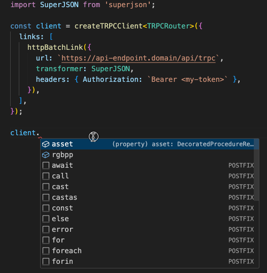

# Magickbase Web3 Platform API

## Usage with TRPC

```ts
import { TRPCRouter } from '@magickbase/p';
import { createTRPCClient, httpBatchLink } from '@trpc/client';
import SuperJSON from 'superjson';

const client = createTRPCClient<TRPCRouter>({
  links: [
    httpBatchLink({
      url: `https://api-endpoint.domain/api/trpc`,
      transformer: SuperJSON,
      headers: {
        Authorization: `Bearer <my-token>`,
      },
    }),
  ],
});
```

If you are using TypeScript we recommend using TRPC to interact with the API for a better development experience.



## Import this Repo

```json
{
  "dependencies": {
    "@magickbase/p": "github:<org>/web3platform"
  }
}
```
